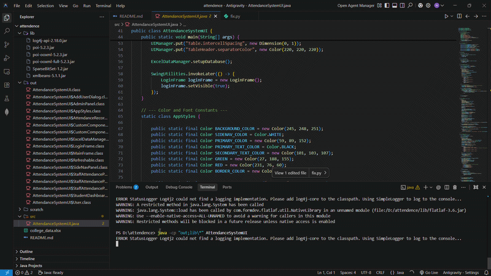

    # Role-Based Student Attendance Management System

    
    

    ## 📖 Project Overview
    The **Role-Based Student Attendance Management System** is a lightweight, modern, and user-friendly desktop application developed in Java. It eliminates the need for complicated database setups by utilizing an Excel-based local database for easy management and immediate portability. 

    The application provides distinct interfaces for different user roles (Admin, Staff, and Students), ensuring secure access and streamlined attendance tracking. With a sleek UI powered by FlatLaf, it offers intuitive dashboards, real-time statistics, and highly efficient attendance logging workflows.

    ### ✨ Key Features
    - **🔑 Role-Based Access Control**: Secure login mechanisms with tailored views and permissions for Admins, Staff, and Students.
    - **👨‍💼 Admin Dashboard**: Manage student and staff accounts (Add/Remove) and view comprehensive campus-wide attendance reports.
    - **👩‍🏫 Staff Dashboard**: Mark attendance quickly for classes, view today's statistics (Present/Absent counts & percentages), and save records with a single click. Includes bulk utilities like "Mark All Present" & "Mark All Absent".
    - **🎓 Student Dashboard**: Personalized view allowing students to track their overall attendance percentage and view their day-to-day attendance history.
    - **📊 Excel Database via Apache POI**: Zero setup database. Uses `college_data.xlsx` for persistent storage, allowing easy viewing, editing, and backups without needing SQL/NoSQL software.
    - **🎨 Modern UI**: Clean, responsive layout using FlatLaf with custom Swing components, stat cards, and conditional status highlighting (Green for Present, Red for Absent).

    ## 🛠️ Tech Stack
    - **Language**: Core Java (JDK 8+)
    - **GUI Framework**: Java Swing
    - **Look and Feel**: [FlatLaf](https://www.formdev.com/flatlaf/) (Flat Light Look and Feel)
    - **Database / File IO**: [Apache POI](https://poi.apache.org/) (for robust reading and writing to `.xlsx` Excel files)

    ## 🚀 Setup Instructions

    Follow these fast and easy steps to get the project up and running on your local machine.

    ### Prerequisites
    - Java Development Kit (JDK 8 or later) installed on your system.
    - Git installed on your system (optional, for cloning).

    ### 1. Clone the Repository
    ```bash
    git clone https://github.com/your-username/your-repository-name.git
    cd your-repository-name
    ```
    *(Make sure to update the URL with your actual GitHub repository URL once uploaded)*

    ### 2. Compile the Code
    The project relies on external libraries located in the `lib` directory. To compile the main file, use the `-cp` (classpath) flag to include everything in `lib`.

    For **Windows**:
    ```cmd
    mkdir out
    javac -cp "lib/*" -d out src/AttendanceSystemUI.java
    ```

    For **Linux/Mac**:
    ```bash
    mkdir -p out
    javac -cp "lib/*" -d out src/AttendanceSystemUI.java
    ```

    ### 3. Run the Application
    Execute the compiled `.class` files, making sure to include both the output directory and the library folder in the classpath.

    For **Windows**:
    ```cmd
    java -cp "out;lib/*" AttendanceSystemUI
    ```

    For **Linux/Mac**:
    ```bash
    java -cp "out:lib/*" AttendanceSystemUI
    ```

    ### 4. Default Login Credentials
    On its first run, the system will automatically create the `college_data.xlsx` file (if it doesn't already exist) and populate it with a default Admin account:
    - **Username (ID)**: `admin`
    - **Password**: `admin123`
    - **Role**: Admin

    *(You can use this default admin account to log in and add new Staff and Student accounts.)*

    ## 📁 Project Structure
    ```text
    .
    ├── lib/                        # Required external dependencies (Apache POI, FlatLaf, etc.)
    ├── src/
    │   └── AttendanceSystemUI.java # Main application source code containing UI & Logic
    ├── out/                        # Compiled .class files (appears after compilation)
    └── README.md                   # Project documentation
    ```
    *(Note: `college_data.xlsx` will appear in the root directory after the first successful launch.)*

    ## 🤝 Contributing
    Contributions, issues, and feature requests are welcome! Feel free to check the [issues page](../../issues).

    ## 📄 License
    This project is open-source and available under the [MIT License](LICENSE).
